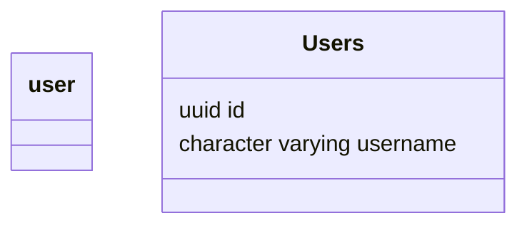
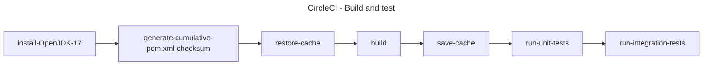

# df-java-template

## :clipboard: Table of Contents

<!-- TOC start (generated with https://github.com/derlin/bitdowntoc) -->

- [:construction: Installation](#construction-installation)
    * [Minimum requirements](#minimum-requirements)
    * [Install the application locally](#install-the-application-locally)
- [:wrench: Development](#wrench-development)
    * [Contract-first](#contract-first)
- [:office: Architecture](#office-architecture)
    * [Hexagonal Architecture](#hexagonal-architecture)
    * [Framework](#framework)
    * [Database](#database)
        + [PostgreSQL, Hibernate, JPA and Liquibase](#postgresql-hibernate-jpa-and-liquibase)
        + [Migrations](#migrations)
    * [Data model](#data-model)
- [:rocket: Infrastructure](#rocket-infrastructure)
    * [Entrypoint and Dependency Injection](#entrypoint-and-dependency-injection)
    * [Endpoints and Services](#endpoints-and-services)
    * [Error Handling](#error-handling)
- [:white_check_mark: Testing strategy](#whitecheckmark-testing-strategy)
    * [Commands](#commands)
    * [Test Structure](#test-structure)
        + [Unit Tests](#unit-tests)
        + [Integration Tests](#integration-tests)
- [:vertical_traffic_light: Continuous Integration](#verticaltrafficlight-continuous-integration)

<!-- TOC end -->

## :construction: Installation

### Minimum requirements

- [Java 17](https://www.oracle.com/java/technologies/javase/jdk17-archive-downloads.html)
- [Maven](https://maven.apache.org/download.cgi)
- [Docker Compose](https://docs.docker.com/compose/install/)

### Install the application locally

- Run `git clone git@github.com:your-organisation/df-java-template.git`
  or `git clone https://github.com/your-organisation/df-java-template.git` to clone the repository
- Run `cd df-java-template` to navigate to the code folder
- Run `./mvnw clean install -T 12 -DskipTests -DskipITs` to install all the dependencies
- Run `docker-compose up` to start the local PostGreSQL Database
- Run `cp .env.example .env.local` to copy the example env file
- Configure your IDE to use this new `.env.local` file
- Run `DfJavaTemplateApplication` class to start the application on the 8080 port.

## :wrench: Development

### Contract-first

In this project, we use a Contract-First API development methodology to generate our API. This is why we use
the [openapi-generator plugin](https://openapi-generator.tech/docs/plugins) to generate our API when building our
application.

You can find the contract of this template-API in
the [df-java-template-api.yaml](./df-java-template-api/src/main/resources/swagger/df-java-template-api.yaml) file. Also,
the configuration
of how this plugin is used can be found in the _pom.xml_ file under the [df-java-template-api](df-java-template-api)
module.

Running `./mvnw clean install -T 12 -DskipTests -DskipITs` in the command line
or `mvn clean install -T 12 -DskipTests -DskipITs` with your IDE
will trigger the plugin.

## :office: Architecture

### Hexagonal Architecture

The structure of this project follows **Hexagonal-Architecture** and **Domain-Driven-Design** principles:

> **Reminder**: _Hexagonal Architecture_ and _Domain-Driven-Development_ allow us to separate our business code (the
> core of our business, this is
> where our added-value lies) from all the technical implementations that we use.

Thus, our project is seperated into 4 main parts:

1. The [domain](domain): As we said before, this where all our business code lies. The domain is isolated from all the
   other modules as it does not depend on any of them.
   Nevertheless, our domain still needs to communicate with the other parts of our application. This is why, we will use
   _application-domain_ interfaces and _domain-infrastructure_ interfaces.
2. The [application](application): This folder contains all the technical implementation that consume our application.
   In this template, a **RestAPI**.
3. The [infrastructure](infrastructure): This folder contains all the technical implementation that are **used by** our
   application. In this template, a **PostgreSQL database**.
4. The [bootstrap](bootstrap): This folder contains all the things that are related to the initialization of our
   application. For instance, we make our [dependency injections](#entrypoint-and-dependency-injection) in it.

### Framework

The framework used for this project is [Spring Boot](https://spring.io/projects/spring-boot). Spring Boot is used to
build java server-side application.
It makes it easy to create stand-alone, production-grade Spring based Applications that you can "just run".

### Database

#### PostgreSQL, Hibernate, JPA and Liquibase

In this project, you will find a simple postgresSQL database configured with Docker as well as:

- [Hibernate](https://hibernate.org/) as your ORM
- [JPA](https://spring.io/guides/gs/accessing-data-jpa/) (Java Persistence API) making the interface between the
  database objects and the domain models
- [Liquibase](https://www.liquibase.org/get-started/quickstart) to simplify _migrations_ running

The configuration of those elements can be found in
the [application.yaml](bootstrap/src/main/resources/application.yaml) file and
they are mainly used in the [postgres-adapter module](infrastructure/postgres-adapter)

The implementation of the _postgres-adapter_ is
placed [here](infrastructure/postgres-adapter/src/main/java/io/df/java/template/infrastructure/postgres/configuration/PostgresConfiguration.java),
away from other configurations, to respect the seperation
of domain modules and technical implementation.

```java

@Configuration
@EnableAutoConfiguration
@EnableTransactionManagement
@EnableJpaAuditing
@EntityScan(basePackages = {"io.df.java.template.infrastructure.postgres.entity"})
@EnableJpaRepositories(basePackages = {"io.df.java.template.infrastructure.postgres.repository"})
public class PostgresConfiguration {

    @Bean
    public PostgresUserAdapter postgresUserAdapter(final UserRepository userRepository) {
        return new PostgresUserAdapter(userRepository);
    }
}
```

#### Migrations

To create a migration, you just need to add a new file in
the [changelogs](infrastructure/postgres-adapter/src/main/resources/db.changelog/changelogs) directory.

An example of migration is already provided in this project.

```sql
create schema if not exists exposition_storage;

create table exposition_storage.user
(
    id       uuid         not null
        constraint user_id primary key,
    username varchar(200) not null
)
```

### Data model

For now, only one table (users) is present as an example in the project.



## :rocket: Infrastructure

### Entrypoint and Dependency Injection

The entrypoint of your application is the `DfJavaTemplateApplication.java` file
located [here](bootstrap/src/main/java/io/df/java/template/bootstrap/DfJavaTemplateApplication.java).
In this file, we import all our configuration files with the `@Import` decorator. This is in those files that we make
our dependency injection as follows:

```java

@Configuration
public class DomainConfiguration {

    @Bean
    public UserService userService(final PostgresUserAdapter postgresUserAdapter) {
        return new UserService(postgresUserAdapter);
    }
}
```

Your `/src/bootstrap` folder will have the same structure as your application. One module for the domain and one for
each adapter you'll need to plug. That is why, for now, we have:

- `DomainConfiguration` --> Our domain
- `RestApiConfiguration` --> our application adapter
- `PosgresConfiguration` --> our infrastructure adapter

### Endpoints and Services

As mentioned before, we define the different endpoints of our API through
our [contract](df-java-template-api/src/main/resources/swagger/df-java-template-api.yaml).

As an example in this project, 1 endpoint can be accessed:

- `(GET) /users/:id` : get a user by its id.

This template has only **one service** called `UserService.java` which contain one method. The one to retrieve a
user by its id.

### Error Handling

You can define your own exceptions (DfException in this example).

```java
// io.df.java.template.domain.DfException.java

@Data
@Builder
public class DfException extends Exception {
    String dfExceptionCode;
    String errorMessage;

    public static boolean isExceptionNotFound(DfException dfException) {
        return dfException.getDfExceptionCode().startsWith("NF");
    }

    public static boolean isExceptionBadRequest(DfException dfException) {
        return dfException.getDfExceptionCode().startsWith("BD.");
    }
}
```

To throw a new custom exception:

1. You define the error message and the ExceptionCode you want to use (the only one in this example is `NF.USER_NOT_FOUND`
   in `io.df.java.template.domain.DfExceptionCode.java`) but you can create others.
2. You map your exception code to a status code in `io.df.java.template.application.rest.api.adapter.mapper.DfExceptionMapper`.
The Exception status code that will be thrown in your http response depends on the naming of your exception (see the [mapDfExceptionToContract](application/rest-api-adapter/src/main/java/io/df/java/template/application/rest/api/adapter/mapper/DfExceptionMapper.java)) method.

> That way, your **domain has no idea of the technical implementation** of your error handling strategy. Therefore, you
> respect the clean architecture and domain-driven-development principles :thumbsup:

## :white_check_mark: Testing strategy

The tests are carried out using the [junit](https://junit.org/junit5/) library.

Faker values are generated with the [javafaker](https://github.com/DiUS/java-faker) library.

Interface mocking are made thanks to the [Mockito](https://site.mockito.org/) library.

### Commands

- Running `./mvnw clean install -T 12` will clean, build and run all the tests of your project.
- Running `./mvnw test -T 12` will run all unit-tests
- Running `./mvnw integration-test -T 12` will run integration-tests

### Test Structure

#### Unit Tests

You will find an example of unit tests in `io.df.java.template.domain.service.UserServiceTest.java` file used to test the behavior of the example
service `UserService.java`.

In those tests, we do not reach external dependencies. Therefore, we must mock things like database access, external api
access, etc...

#### Integration Tests

Those tests are located in `/bootstrap/src/test/java/io/df/java/template/bootstrap/it` and are here to test the global behavior of our API. We must fake a
start of our application and this is done
by the `DfJavaTemplateITApplication.java` file located in `/bootstrap/src/test/java/io/df/java/template/bootstrap/`.

The only integration test written in this project is:

```java
public class UserApiIT extends AbstractDfJavaTemplateBackForFrontendApiIT {

    @Autowired
    public UserRepository userRepository;

    @Test
    void should_find_user_for_user_id() {
        final UUID userId = UUID.randomUUID();
        final String username = faker.ancient().god();
        final UserEntity userEntity = userRepository.save(
                UserEntity.builder()
                        .id(userId)
                        .username(username)
                        .build()
        );

        // When
        client.get()
                .uri(getApiURIWithPathParams(REST_API_USERS, Map.of("id", userId.toString())))
                .exchange()
                // Then
                .expectStatus()
                .is2xxSuccessful()
                .expectBody()
                .jsonPath("$.id").isEqualTo(userId.toString())
                .jsonPath("$.username").isEqualTo(username)
                .jsonPath("$.error").isEmpty();

    }
}
```

## :vertical_traffic_light: Continuous Integration

A configuration for [circleci](https://circleci.com/) is already present in this project at `.circleci/config.yml`.

**Because** we use [testcontainers](https://java.testcontainers.org/) to create a _database container_ in order to perform our integration tests,
**we must** use a real machine in our CI/CD. Because we can't run our testcontainer docker image in another docker image.

Only one job is present in this workflow and the steps of this job are:

